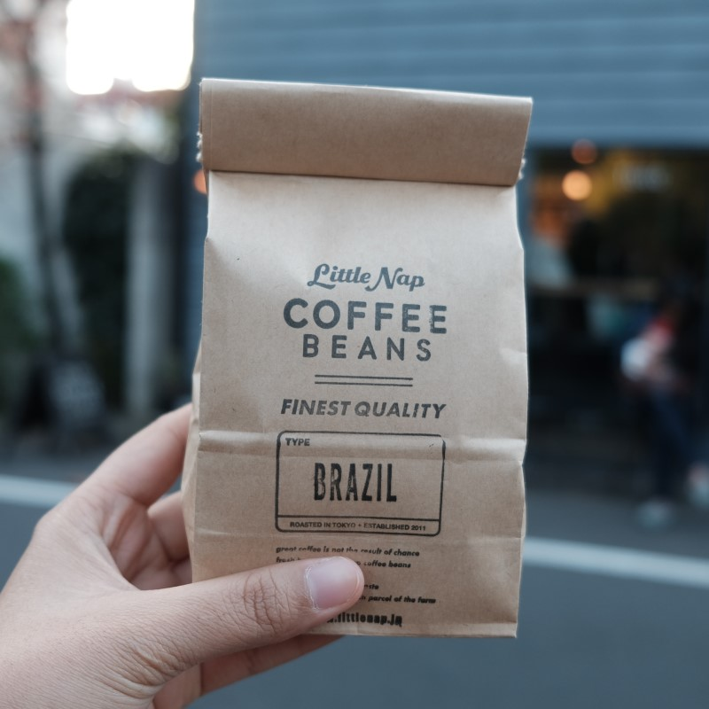

<!doctype html>
<html lang="en">
  <head>
    <meta charset="UTF-8" />
    <meta http-equiv="X-UA-Compatible" content="IE=edge" />
    <meta name="viewport" content="width=device-width, initial-scale=1.0" />
    <title>NataDeCoco</title>

    <!-- Fonts -->
    <link rel="preconnect" href="https://fonts.googleapis.com" />
    <link rel="preconnect" href="https://fonts.gstatic.com" crossorigin />
    <link
      href="https://fonts.googleapis.com/css2?family=Poppins:ital,wght@0,100;0,300;0,400;0,700;1,700&display=swap"
      rel="stylesheet"
    />

    <!-- Feather Icons -->
    

    <!-- My Style -->
    <link rel="stylesheet" href="css/style.css" />
  </head>

  <body>
    <!-- Navbar start -->
    <nav class="navbar">
      <a href="#" class="navbar-logo">NataDe'Coco.</a>

      

        <a href="index.html">Home</a>
        <a href="index.html#about">Tentang Kami</a>
        <a href="#">Menu & Product</a>
        <a href="contact.html">Kontak</a>
      

      

        <a href="#" id="search-button"><i data-feather="search"></i></a>
        <a href="#" id="shopping-cart-button"
          ><i data-feather="shopping-cart"></i
        ></a>
        <a href="#" id="hamburger-menu"><i data-feather="menu"></i></a>
      

    </nav>

    <!-- Menu Section start -->
    <section id="menu" class="menu">
      <h2>Menu Kami</h2>
      

        Lorem ipsum dolor sit amet consectetur, adipisicing elit. Expedita,
        repellendus numquam quam tempora voluptatum.
      

      

        

          
          <h3 class="menu-card-title">- Espresso -</h3>
          
IDR 15K

        

        

          
          <h3 class="menu-card-title">- Capuccino -</h3>
          
IDR 25K

        

        

          
          <h3 class="menu-card-title">- Latte -</h3>
          
IDR 20K

        

        

          
          <h3 class="menu-card-title">- Espresso -</h3>
          
IDR 15K

        

        

          
          <h3 class="menu-card-title">- Espresso -</h3>
          
IDR 15K

        

        

          
          <h3 class="menu-card-title">- Espresso -</h3>
          
IDR 15K

        

      

    </section>
    <!-- Menu Section end -->
    <!-- Products Section start -->
    <section class="products" id="products">
      <h2>Produk Unggulan Kami</h2>
      

        Lorem ipsum dolor sit amet consectetur adipisicing elit. Illo unde eum,
        ab fuga possimus iste.
      

      

        

          

            <a href="#"><i data-feather="shopping-cart"></i></a>
            <a href="#" class="item-detail-button"
              ><i data-feather="eye"></i
            ></a>
          

          

            
          

          

            <h3>Coffee Beans 1</h3>
            

              <i data-feather="star" class="star-full"></i>
              <i data-feather="star" class="star-full"></i>
              <i data-feather="star" class="star-full"></i>
              <i data-feather="star" class="star-full"></i>
              <i data-feather="star"></i>
            

            
IDR 30K IDR 55K

          

        

        

          

            <a href="#"><i data-feather="shopping-cart"></i></a>
            <a href="#" class="item-detail-button"
              ><i data-feather="eye"></i
            ></a>
          

          

            
          

          

            <h3>Coffee Beans 1</h3>
            

              <i data-feather="star"></i>
              <i data-feather="star"></i>
              <i data-feather="star"></i>
              <i data-feather="star"></i>
              <i data-feather="star"></i>
            

            
IDR 30K IDR 55K

          

        

        

          

            <a href="#"><i data-feather="shopping-cart"></i></a>
            <a href="#" class="item-detail-button"
              ><i data-feather="eye"></i
            ></a>
          

          

            
          

          

            <h3>Coffee Beans 1</h3>
            

              <i data-feather="star"></i>
              <i data-feather="star"></i>
              <i data-feather="star"></i>
              <i data-feather="star"></i>
              <i data-feather="star"></i>
            

            
IDR 30K IDR 55K

          

        

      

    </section>
    <!-- Products Section end -->

    <!-- Footer start -->
    <footer>
      

        <a href="#"><i data-feather="instagram"></i></a>
        <a href="#"><i data-feather="twitter"></i></a>
        <a href="#"><i data-feather="facebook"></i></a>
      

      

        <a href="#home">Home</a>
        <a href="#about">Tentang Kami</a>
        <a href="#menu">Menu</a>
        <a href="#contact">Kontak</a>
      

      

        
Created by <a href="">Kelompok NataDeCoco</a>. | &copy; 2026.

      

    </footer>
    <!-- Footer end -->

    <!-- Modal Box Item Detail start -->
    

      

        <a href="#" class="close-icon"><i data-feather="x"></i></a>
        

          
          

            <h3>Product 1</h3>
            

              Lorem ipsum dolor sit amet consectetur, adipisicing elit.
              Provident, tenetur cupiditate facilis obcaecati ullam maiores
              minima quos perspiciatis similique itaque, esse rerum eius
              repellendus voluptatibus!
            

            

              <i data-feather="star" class="star-full"></i>
              <i data-feather="star" class="star-full"></i>
              <i data-feather="star" class="star-full"></i>
              <i data-feather="star" class="star-full"></i>
              <i data-feather="star"></i>
            

            
IDR 30K IDR 55K

            <a href="#"
              ><i data-feather="shopping-cart"></i> add to cart</a
            >
          

        

      

    

    <!-- Modal Box Item Detail end -->

    <!-- Feather Icons -->
    

    <!-- My Javascript -->
    
  </body>
</html>
